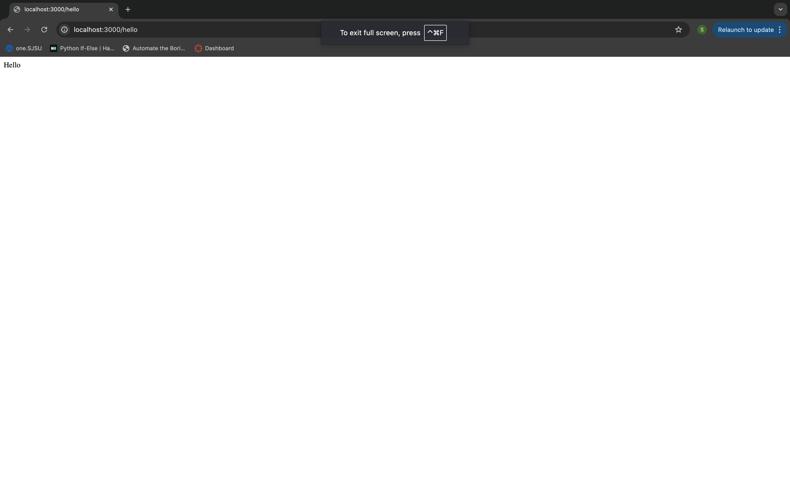
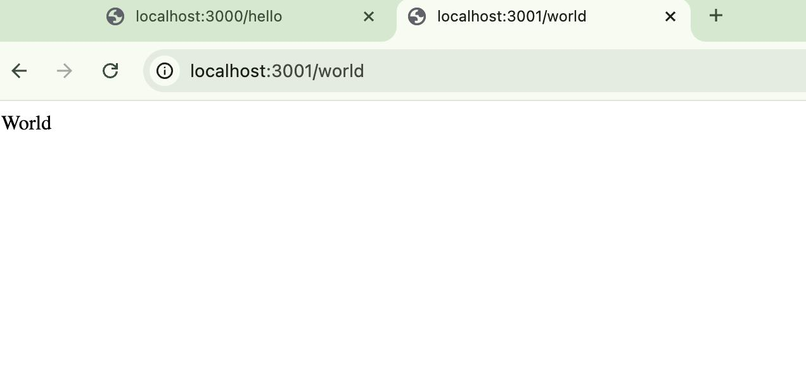

## Assignment - 1 </br>
Created a simple "Hello World" microservices </br>
</br>
### Step 1: </br>
Installed VS code
Installed git and cloned my repository</br>
</br>
### Step 2: </br>
I choosed Node.js with Express.js Programming Language and Framework to create micro services </br>
Command lines which I used are  : </br>
`npm init -y` initializing the project <br>
`npm install express` and `npm install axios` to install </br>
Installed docker and Kubernates.</br>
Used minikubes in the kubernates, installed them with the following command:</br>
`brew install minikube` </br>
`minikube start` to start minikube </br>
</br>
### Step 3: </br>
### Hello Service: </br>
Created an Endpoint /hello that returns the string "Hello" </br>
Created dockerfile for this Hello micro service</br>
Built a docker image </br>
Commands to build docker image:</br>
```docker build -t hello-service``` .</br>
To run docker image, commad I used is:</br>
```docker run -p 3000:3000 hello-service```</br>
Now, I pushed the Docker Image to Docker hub by using following commands:</br>
```docker tag hello-service:latest siriuppula/hello-service``` </br>
```docker push siriuppula/hello-service``` </br>
Running the service locally : </br>
 </br>
Deployed it in Kubernetes for this service. </br>
The code is in the "hello-service.yaml" file </br>
Commands Used are: </br>
```minikube start``` </br>
```kubectl apply -f k8s/hello-service-deployment.yaml``` </br>
Check the Kubernetes service is running or not:</br>
 </br>
</br>
###Step 4: </br>
### World Service: </br>
Created an Endpoint /hello that returns the string "World" </br>
Created dockerfile for this World micro service</br>
Built a docker image </br>
Commands to build docker image:</br>
`docker build -t world-service` .</br>
To run docker image, commad I used is:</br>
```docker run -p 3001:3000 world-service```</br>
Now, I pushed the Docker Image to Docker hub by using following commands:</br>
```docker tag world-service:latest siriuppula/world-service``` </br>
Running the service locally:</br>
 </br>
Deployed it in Kubernetes for this service. </br>
The code is in the "world-service.yaml" file </br>
Commands Used are: </br>
```minikube start``` </br>
```kubectl apply -f k8s/world-service-deployment.yaml``` </br>
Check the Kubernetes service is running or not:</br>
 </br>


